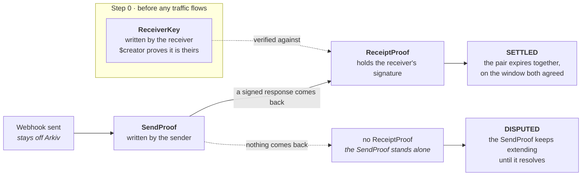

# Countersign

**An independent record of when a webhook was sent and when it was actually received**, so a "we never got that" dispute has a real answer instead of one side's word against the other's.

Submitted to the Arkiv *What can YOU [ ARKIV ] ?* Ideathon 2026 — **Other (open lane)**.

This is an idea and its Arkiv data model. Nothing is deployed.

---

## The problem

Webhooks are how one company's system tells another that something happened: a payment succeeded, an order shipped, a subscription changed. They are well documented to fail silently or get lost.

When one goes missing, two companies with a perfectly good-faith relationship end up in a genuine, hard-to-settle disagreement. The sender checks its logs and sees the webhook was sent. The receiver checks its logs and sees nothing arrived. Both are reading their own systems honestly, and neither can show the other anything convincing.

Tools like Hookdeck and Svix improve logging and retries **inside the sender's own infrastructure**. That does not settle the argument, because a better log is still one party's own system, and the other party has no reason to accept it.

The record has to belong to neither of them.

---

## How it works



**Silence is what keeps evidence alive, not a blanket timer on everything.**

A rendered version of this diagram, set as a single sheet you can screenshot, is in [`index.html`](index.html).

---

## The three entities

### `ReceiverKey` — written by the receiver, once

| attribute | type | notes |
| :--- | :--- | :--- |
| `receiverId` | string | per-relationship pseudonym |
| `publicKey` | string | the key every receipt verifies against |
| `validFrom` | **integer** | unix time |
| `status` | string | `"active"` or `"revoked"` |

`$creator` is the receiver. This is the only thing a receiver ever writes, and it happens at integration time rather than during a dispute. It is what makes a signature impossible to disown later.

Rotating a key means writing a new one, never editing the old one, so historical receipts stay verifiable against the key that was actually in force when they were signed.

### `SendProof` — written by the sender, on send

| attribute | type | notes |
| :--- | :--- | :--- |
| `webhookId` | string | the shared key |
| `senderId` | string | per-relationship pseudonym |
| `receiverId` | string | per-relationship pseudonym |
| `eventType` | string | from a small fixed set |
| `payloadHash` | string | a hash, never the payload |
| `timestamp` | **integer** | unix time |
| `expectedBy` | **integer** | unix time — when acknowledgement is due |

`$creator` is the sender automatically, so no separate signature field is needed.

### `ReceiptProof` — written by the sender, when the response returns

| attribute | type | notes |
| :--- | :--- | :--- |
| `webhookId` | string | links to its SendProof |
| `processedAt` | **integer** | unix time |
| `status` | string | `"processed"` or `"failed"` |
| `receiverSignedResponse` | string | the receiver's own signed HTTP response |
| `keyRef` | string | the ReceiverKey this verifies against |

The receipt is written by the sender, so `$creator` cannot vouch for it. What vouches for it is the receiver's signature inside it, checked against a key the receiver wrote itself and cannot disown. **That is why the key registry exists**, and it is the difference between a record two parties accept and a record one party asserts.

---

## The queries

```js
// 1 · One dispute, resolved directly
eq("webhookId", "…")            // returns the SendProof and any linked ReceiptProof

// 2 · Everything overdue and unacknowledged
eq("senderId", "…") · lt("expectedBy", <now>)
// then reconcile client-side against ReceiptProofs — Arkiv has no joins,
// so absence cannot be queried directly

// 3 · A receiver's processing history for one sender
eq("receiverId", "…") · eq("senderId", "…") · eq("status", "processed")
```

Query 2 is nearly free, and expiry is the reason. Because settled proofs lapse on the agreed window while unanswered ones keep getting extended, **almost everything still alive past its `expectedBy` is already the missing set**. Expiry does most of the reconciling before the query runs.

Results come back newest-first. Arkiv has no server-side `ORDER BY`, so any other ordering is client-side over what you already fetched.

---

## Expiry, extension and ownership

| entity | lifetime | what it encodes |
| :--- | :--- | :--- |
| `ReceiverKey` | long, renewed while in use | outlives every proof that verifies against it |
| `SendProof` **unmatched** | extended in short increments | the disputed case — silence keeps it alive |
| `SendProof` + `ReceiptProof` **paired** | expire **together**, on the agreed window | settled; the window is also the dispute deadline |

The pair is set to the same expiry the moment the receipt is written, so you can never hold half a record. Extension is run by the sender's own service, because the sender is the party with a reason to keep unanswered proofs alive. Nothing on Arkiv extends itself — Arkiv stores and answers, it never executes logic.

Only high-stakes and money-moving event types are recorded, not every webhook.

---

## Why Arkiv, and what stays off it

A sender's own delivery log, however good, is still their own system, and proves nothing to a receiver who does not trust them. This works because the record is **independent of both parties**, **tamper-proof** so neither side can edit their claim once a dispute starts, and **queryable** so the real answer is checkable by both sides immediately.

Expiry is not cleanup here. It is the mechanism that separates a settled exchange from a contested one, without anyone having to declare which is which.

**A single company benefits alone on day one**, before any partner adopts. A sender writing SendProofs by itself already holds timestamped, independently checkable evidence that beats its own internal logs in any future argument.

**Stays off Arkiv:** the delivery itself, retries, and payload contents. Only a hash and the proof that sending and receiving happened.

**Privacy:** identifiers are per-relationship. Two companies agree a random identifier for their pairing at integration time and keep it in their own systems, so the same sender looks like a different party to every partner it works with. A plain hash of a company name would not do this, since the list of company names is short enough to work backwards from. Either party can hand the mapping to an arbitrator when they want the record read against real names.

---

## Scope and open questions

**Weekend slice.** A wrapper around the sender's existing HTTP call. It writes the SendProof as the request goes out and the ReceiptProof when the response comes back, plus one page listing everything past its `expectedBy` with nothing paired to it. That proves the whole loop with real entities and touches only the sender.

**Not building.** No dispute resolution — Countersign produces the record that settles an argument, it does not decide who was right. And no replacement for delivery, retries or queueing, which stay in the infrastructure both companies already run.

**Riskiest assumption.** That receivers will sign their HTTP responses. Almost none do today, and it is a code change on the side with the least to gain. Testable without building anything by asking a handful of integration engineers whether they would add it for a partner who asked.

If the answer is no, the product still works in a weaker form. A sender writing SendProofs alone already holds evidence better than its own logs, so signed responses are the upgrade rather than the entry price.
